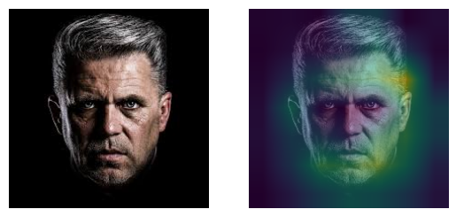

# GradCAM

Grad-CAM overlays a heat map over an input image by highlighting regions that are most important

The gradients are globally averaged across each feature map to obtain the importance weights for each channel

## Heatmap overlap example

